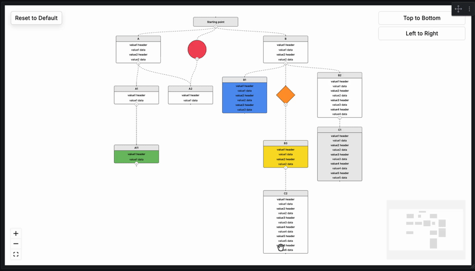
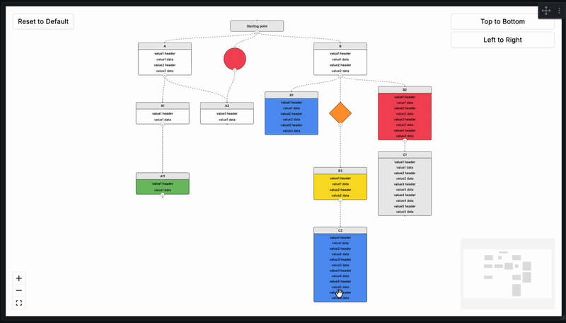
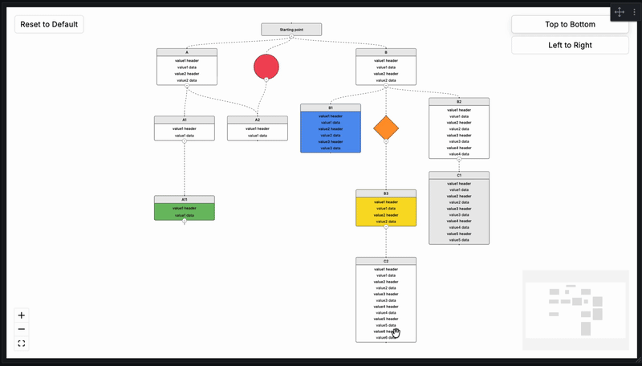

# FlowX

The FlowX Grafana panel enables the rendering of interactive flowcharts derived from directed graph data, consisting of nodes and edges. FlowX supports a variety of node types, each designed for specific use cases. Grafana provides a Node Graph panel for visualizing directed graph data, but its visualization capabilities are quite limited. To address the need for more advanced and rich visualizations of directed graphs, this panel has been developed. It leverages ReactFlow and DagreJS to deliver enhanced visualization features.

## Demo

## Requirements

| FlowX Version   | Minimum Grafana Version |
| --------------- | ----------------------- |
| 2.0.0+          | 11.6.11                 |
| 1.0.3 and below | 10.1.0                  |

> **Note:** FlowX 2.0.0+ requires Grafana 11.6.11 or higher due to React 19 compatibility changes introduced in Grafana 13. If you are running Grafana 10.x, please use FlowX version 1.0.3.

## Installation

Installing plugin on Grafana Cloud / Local Grafana - https://grafana.com/docs/grafana/latest/plugins/installation/

## Configuration

To use the FlowX panel, 2 different queries called "Node" and "Edge" must be added.
The "Node" query is for determining the boxes, circles and diamonds we will draw.
The "Edge" query is for determining the relationship between the nodes we draw.
The expected columns in Node and Edge queries are as shared below.
All data to come to the columns are optional (yes, including IDs, if an empty row comes, an empty node with no relationship will be drawn.)
**The expected data type is string for all columns.**

## Node

The following table describes expected columns of the Node query:

| Columns         | Supported Values                                                                                                                | Description                                                                                                                                             |
| --------------- | ------------------------------------------------------------------------------------------------------------------------------- | ------------------------------------------------------------------------------------------------------------------------------------------------------- |
| id              |                                                                                                                                 | Unique identifier of the Node. Each Node to be drawn must have a unique ID. These ID's will be used in the Source or Target fields in the "Edge" query. |
| type            | `title` `one` `two` `three` `four` `five` `six` `circle` `diamond`                                                             | Determines the type of Node. The Node is drawn according to this data. However, if the popup is active, all values will appear there. Default: `four`   |
| title           |                                                                                                                                 | Title of the Node.                                                                                                                                      |
| value1_header   |                                                                                                                                 | The header that will come for the first value of the node.                                                                                              |
| value1_data     |                                                                                                                                 | The data that will come for the first value of the node.                                                                                                |
| value1_url      |                                                                                                                                 | The URL that will come for the first value of the node. "Show Popup" must be on to use.                                                                 |
| value2_header   |                                                                                                                                 | The header that will come for the second value of the node.                                                                                             |
| value2_data     |                                                                                                                                 | The data that will come for the second value of the node.                                                                                               |
| value2_url      |                                                                                                                                 | The URL that will come for the second value of the node. "Show Popup" must be on to use.                                                                |
| value3_header   |                                                                                                                                 | The header that will come for the third value of the node.                                                                                              |
| value3_data     |                                                                                                                                 | The data that will come for the third value of the node.                                                                                                |
| value3_url      |                                                                                                                                 | The URL that will come for the third value of the node. "Show Popup" must be on to use.                                                                 |
| value4_header   |                                                                                                                                 | The header that will come for the fourth value of the node.                                                                                             |
| value4_data     |                                                                                                                                 | The data that will come for the fourth value of the node.                                                                                               |
| value4_url      |                                                                                                                                 | The URL that will come for the fourth value of the node. "Show Popup" must be on to use.                                                                |
| value5_header   |                                                                                                                                 | The header that will come for the fifth value of the node.                                                                                              |
| value5_data     |                                                                                                                                 | The data that will come for the fifth value of the node.                                                                                                |
| value5_url      |                                                                                                                                 | The URL that will come for the fifth value of the node. "Show Popup" must be on to use.                                                                 |
| value6_header   |                                                                                                                                 | The header that will come for the sixth value of the node.                                                                                              |
| value6_data     |                                                                                                                                 | The data that will come for the sixth value of the node.                                                                                                |
| value6_url      |                                                                                                                                 | The URL that will come for the sixth value of the node. "Show Popup" must be on to use.                                                                 |
| color_condition | `red` `red_blink` `orange` `orange_blink` `yellow` `yellow_blink` `green` `green_blink` `blue` `blue_blink` `gray` `gray_blink` | Field that determines the background color of the node. Blink ones flash. Default: _null_                                                               |
| url             |                                                                                                                                 | Field that can be used for the node's own URL. "Show Popup" must be on to use.                                                                          |
| url_label       |                                                                                                                                 | The label that will replace the node's own URL.                                                                                                         |

## Edge

The following table describes expected columns of the Edge query:

| Columns | Description                                                                 |
| ------- | --------------------------------------------------------------------------- |
| id      | Unique identifier of the Edge. Each Edge to be drawn must have a unique ID. |
| source  | Source Node ID                                                              |
| target  | Target Node ID                                                              |

 

#### Supported Types of Node

| type    | Description                                                                                                                                                                                                                                                                               |
| ------- | ----------------------------------------------------------------------------------------------------------------------------------------------------------------------------------------------------------------------------------------------------------------------------------------- |
| _null_  | Default, node type will be set as `four`.                                                                                                                                                                                                                                                 |
| title   | Node showing only `title` column.                                                                                                                                                                                                                                                         |
| one     | Node showing `title`, `value1_header`, `value1_data`.                                                                                                                                                                                                                                     |
| two     | Node showing `title`, `value1_header`, `value1_data`, `value2_header`, `value2_data`.                                                                                                                                                                                                     |
| three   | Node showing `title` and value rows 1–3.                                                                                                                                                                                                                                                  |
| four    | Node showing `title` and value rows 1–4.                                                                                                                                                                                                                                                  |
| five    | Node showing `title` and value rows 1–5.                                                                                                                                                                                                                                                  |
| six     | Node showing `title` and value rows 1–6.                                                                                                                                                                                                                                                  |
| circle  | A node with circle shape that does not display value columns on the node itself.                                                                                                                                                                                                          |
| diamond | A node with diamond shape that does not display value columns on the node itself.                                                                                                                                                                                                         |

> If "Show Popup" is enabled, all fields (title, values 1–6, URL) are shown in the popup regardless of node type.

 

#### Supported Colors of Node

| color_condition | Description                           |
| --------------- | ------------------------------------- |
| _null_          | Default, paints the background white. |
| red             | Paints the background #f2495c.        |
| red_blink       | Blinks between #f2495c and white.     |
| orange          | Paints the background #ff9830.        |
| orange_blink    | Blinks between #ff9830 and white.     |
| yellow          | Paints the background #fade2a.        |
| yellow_blink    | Blinks between #fade2a and white.     |
| green           | Paints the background #73bf69.        |
| green_blink     | Blinks between #73bf69 and white.     |
| blue            | Paints the background #5794f2.        |
| blue_blink      | Blinks between #5794f2 and white.     |
| gray            | Paints the background #ebebeb.        |
| gray_blink      | Blinks between #ebebeb and white.     |

## Collapse / Expand

Every node that has children displays a small collapse/expand button at the point where its outgoing edge begins. Clicking it hides or reveals the subtree beneath that node.

- Collapsing a node hides all of its descendants and collapses them automatically.
- Expanding a node shows only its direct children. Grandchildren remain collapsed until manually expanded.
- Nodes with multiple parents remain visible as long as at least one parent is open.
- Cycles in the graph (A → B → A) are handled safely.

The **Initial Depth** panel option controls how many levels are visible when the panel first loads:

| Value | Behavior                                        |
| ----- | ----------------------------------------------- |
| `0`   | All nodes expanded (default)                    |
| `1`   | Only root nodes visible                         |
| `2`   | Roots and their direct children visible         |
| `n`   | Nodes up to depth `n` visible, rest collapsed   |

The **Reset to Default** button (top-left corner, visible when "Show Layout Options" is on) clears all manually dragged positions and resets the collapse state back to the configured Initial Depth.

## FlowX Panel Options

The following table describes FlowX panel options:

| Category            | Option                        | Values                                                  | Default         | Description                                                                                         |
| ------------------- | ----------------------------- | ------------------------------------------------------- | --------------- | --------------------------------------------------------------------------------------------------- |
| Background Settings | Background Color              | Grafana Color Palette                                   | `#ffffff`       |                                                                                                     |
| Background Settings | Background Type               | `None` `Dots` `Cross` `Lines`                           | `None`          |                                                                                                     |
| Background Settings | Type Gap                      | 1 – 50                                                  | `28`            |                                                                                                     |
| Background Settings | Type Size                     | 1 – 10                                                  | `1`             |                                                                                                     |
| Background Settings | Type Color                    | Grafana Color Palette                                   | `#000000`       |                                                                                                     |
| Layout Settings     | Layout Direction              | `Top to Bottom` `Left to Right`                         | `Top to Bottom` |                                                                                                     |
| Layout Settings     | Show Layout Options           | `on` `off`                                              | `on`            |                                                                                                     |
| Layout Settings     | Show Mini Map                 | `on` `off`                                              | `on`            |                                                                                                     |
| Layout Settings     | Show Controls                 | `on` `off`                                              | `on`            |                                                                                                     |
| Layout Settings     | Hide Attribution (Pro)        | `on` `off`                                              | `off`           | Please only hide the attribution if you are subscribed to React Flow Pro: https://reactflow.dev/pro |
| Layout Settings     | Maximum Zoom                  | 1 – 10                                                  | `4`             |                                                                                                     |
| Layout Settings     | Minimum Zoom                  | 0.1 – 1                                                 | `0.1`           |                                                                                                     |
| Node Settings       | Draggable Nodes               | `on` `off`                                              | `off`           | Drag positions are preserved across data refreshes. Reset to Default clears them.                   |
| Node Settings       | Fit View on Collapse/Expand   | `on` `off`                                              | `off`           | Automatically fits the view whenever a node is collapsed or expanded.                               |
| Node Settings       | Show Popup                    | `on` `off`                                              | `off`           | Must be enabled to use Node or Value URLs.                                                          |
| Node Settings       | Initial Depth                 | integer ≥ 0                                             | `0`             | Number of levels visible on load. `0` = all expanded. See Collapse / Expand section above.         |
| Edge Settings       | Edge Animation                | `on` `off`                                              | `on`            |                                                                                                     |
| Edge Settings       | Edge Type                     | `Default` `Straight` `Step` `Smoothstep` `Simplebezier` | `Default`       |                                                                                                     |
| Edge Settings       | Edge Stroke                   | 1 – 10                                                  | `1`             |                                                                                                     |
| Edge Settings       | Edge Color                    | Grafana Color Palette                                   | `#000000`       |                                                                                                     |
| Node Field Mapping  | ID                            | string                                                  | `id`            | Maps a custom column name to the `id` field. Leave empty to use default.                            |
| Node Field Mapping  | Type                          | string                                                  | `type`          | Maps a custom column name to the `type` field. Leave empty to use default.                          |
| Node Field Mapping  | Title                         | string                                                  | `title`         | Maps a custom column name to the `title` field. Leave empty to use default.                         |
| Node Field Mapping  | Color Condition               | string                                                  | `color_condition` | Maps a custom column name to the `color_condition` field. Leave empty to use default.             |
| Node Field Mapping  | URL                           | string                                                  | `url`           | Maps a custom column name to the `url` field. Leave empty to use default.                           |
| Node Field Mapping  | URL Label                     | string                                                  | `url_label`     | Maps a custom column name to the `url_label` field. Leave empty to use default.                     |
| Node Field Mapping  | Value 1 Header                | string                                                  | `value1_header` | Maps a custom column name to the `value1_header` field. Leave empty to use default.                 |
| Node Field Mapping  | Value 1 Data                  | string                                                  | `value1_data`   | Maps a custom column name to the `value1_data` field. Leave empty to use default.                   |
| Node Field Mapping  | Value 1 URL                   | string                                                  | `value1_url`    | Maps a custom column name to the `value1_url` field. Leave empty to use default.                    |
| Node Field Mapping  | Value 2 Header                | string                                                  | `value2_header` | Maps a custom column name to the `value2_header` field. Leave empty to use default.                 |
| Node Field Mapping  | Value 2 Data                  | string                                                  | `value2_data`   | Maps a custom column name to the `value2_data` field. Leave empty to use default.                   |
| Node Field Mapping  | Value 2 URL                   | string                                                  | `value2_url`    | Maps a custom column name to the `value2_url` field. Leave empty to use default.                    |
| Node Field Mapping  | Value 3 Header                | string                                                  | `value3_header` | Maps a custom column name to the `value3_header` field. Leave empty to use default.                 |
| Node Field Mapping  | Value 3 Data                  | string                                                  | `value3_data`   | Maps a custom column name to the `value3_data` field. Leave empty to use default.                   |
| Node Field Mapping  | Value 3 URL                   | string                                                  | `value3_url`    | Maps a custom column name to the `value3_url` field. Leave empty to use default.                    |
| Node Field Mapping  | Value 4 Header                | string                                                  | `value4_header` | Maps a custom column name to the `value4_header` field. Leave empty to use default.                 |
| Node Field Mapping  | Value 4 Data                  | string                                                  | `value4_data`   | Maps a custom column name to the `value4_data` field. Leave empty to use default.                   |
| Node Field Mapping  | Value 4 URL                   | string                                                  | `value4_url`    | Maps a custom column name to the `value4_url` field. Leave empty to use default.                    |
| Node Field Mapping  | Value 5 Header                | string                                                  | `value5_header` | Maps a custom column name to the `value5_header` field. Leave empty to use default.                 |
| Node Field Mapping  | Value 5 Data                  | string                                                  | `value5_data`   | Maps a custom column name to the `value5_data` field. Leave empty to use default.                   |
| Node Field Mapping  | Value 5 URL                   | string                                                  | `value5_url`    | Maps a custom column name to the `value5_url` field. Leave empty to use default.                    |
| Node Field Mapping  | Value 6 Header                | string                                                  | `value6_header` | Maps a custom column name to the `value6_header` field. Leave empty to use default.                 |
| Node Field Mapping  | Value 6 Data                  | string                                                  | `value6_data`   | Maps a custom column name to the `value6_data` field. Leave empty to use default.                   |
| Node Field Mapping  | Value 6 URL                   | string                                                  | `value6_url`    | Maps a custom column name to the `value6_url` field. Leave empty to use default.                    |
| Edge Field Mapping  | ID                            | string                                                  | `id`            | Maps a custom column name to the edge `id` field. Leave empty to use default.                       |
| Edge Field Mapping  | Source                        | string                                                  | `source`        | Maps a custom column name to the `source` field. Leave empty to use default.                        |
| Edge Field Mapping  | Target                        | string                                                  | `target`        | Maps a custom column name to the `target` field. Leave empty to use default.                        |

## Field Mapping

If your data source uses different column names than the FlowX defaults (e.g. Elasticsearch, custom SQL), you can remap them using the **Node Field Mapping** and **Edge Field Mapping** panel option categories.

**Example:** Your Elasticsearch index has a field called `status` instead of `color_condition`. Set *Color Condition* to `status` in Node Field Mapping and FlowX will read from that column automatically.

- All mapping fields are **optional**. Leave them empty to use the default column names.
- Only the fields you configure are overridden — the rest continue to use defaults.
- Grafana's built-in field rename transformations still work alongside this feature.

## Support

Support the continued development of FlowX for Grafana. Your contribution helps fund new features, improvements, bug fixes, and long-term maintenance. ☕

## Contact

Write on [Linkedin](https://www.linkedin.com/in/anilhut)

## Credits and References

1. [ReactFlow](https://reactflow.dev/)
2. [DagreJS](https://github.com/dagrejs/dagre)
3. [Build a panel plugin tutorial](https://grafana.com/tutorials/build-a-panel-plugin)
4. [Grafana documentation](https://grafana.com/docs/)
5. [Grafana Tutorials](https://grafana.com/tutorials/)
6. [Grafana UI Library](https://developers.grafana.com/ui)
